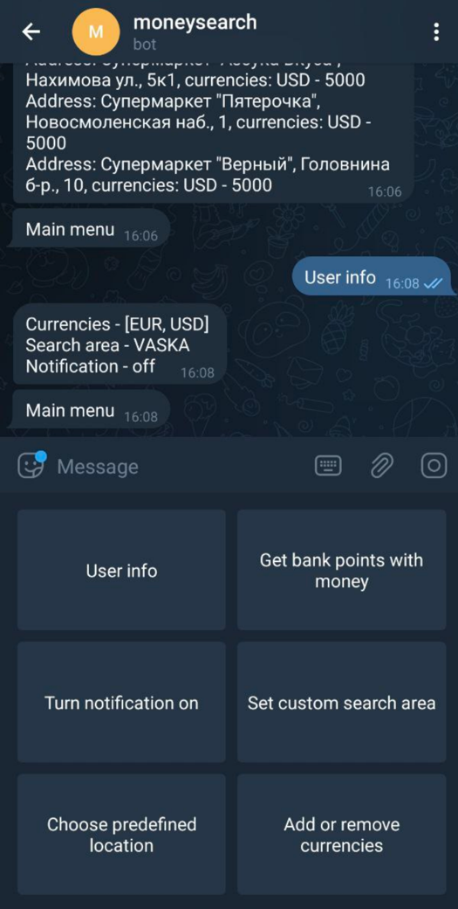

# Moneysearch

Telegram bot that sends notifications about bank points that have money of particular currency and in particular location

## User stories
1) User can choose currencies
2) User can choose predefined area: Vaska or whole SPB
3) User can set custom area by choosing point on map and distance from this point
4) User can get list of bank points that satisfies search criteria
5) User can turn on/off notifications 
6) User can see what he/she chose

## What is needed to make bot work

`BankApiAdapter` has to be implemented in order make the bot to work\
The implementation has to contain fetching data from some bank service

`.env` has to contain three values
1) `BOT_TOKEN` - provided by Bot Father
2) `BOT_NAME` - provided by Bot Father
3) `ALLOWED_USERS` - list of users that are allowed to use the bot, values have to be separated by comma

Then you can call `./start.sh` and the bot has to start working

## Example of interface

